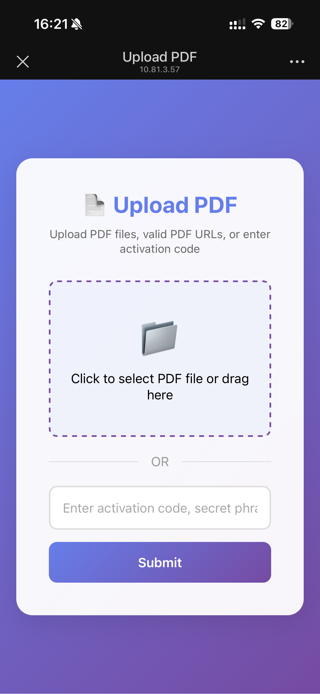
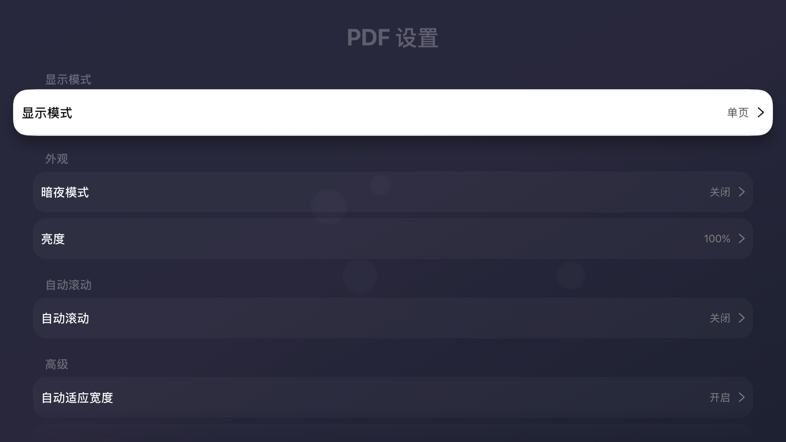

# TVPDF

  

TVOS上使用PDF查看工具，可以查看SMB文件系统、本地的PDF文件，同时可以通过手机投屏将url，已经本地文件上传到tv上进行pdf的查看 
TF地址 
- [https://testflight.apple.com/join/4kqbe61s](https://testflight.apple.com/join/4kqbe61s)

# PDF展示

  

  

# PDF历史记录
PDF历史页面，默认没有数据

  

查看过PDF数据后会添加到该列表页面

  

# 文件列表
目前文件列表包含三种数据 
1.SMB服务器 
2.本地文件 
3.上传PDF，上传PDF会显示二维码，手机端可以上传PDF的url地址，已经上传手机端本地以及icloud中的PDF文件上传，上传后文件会保存在本地文件中 

  

  

# 设置
PDF设置页面可以设置PDF的展示方式

  

### releases

- [releases.md](https://github.com/never88gone/XHLPDF/blob/main/releases.md?plain=1)

### Telegram Group
-  [https://t.me/tanghulutvos](https://t.me/tanghulutvos)

 

  

### Links

-  [SwiftyJSON/SwiftyJSON](https://github.com/SwiftyJSON/SwiftyJSON)
-  [yichengchen/swifter](https://github.com/yichengchen/swifter)
-  [mattt/Ono](https://github.com/mattt/Ono)
